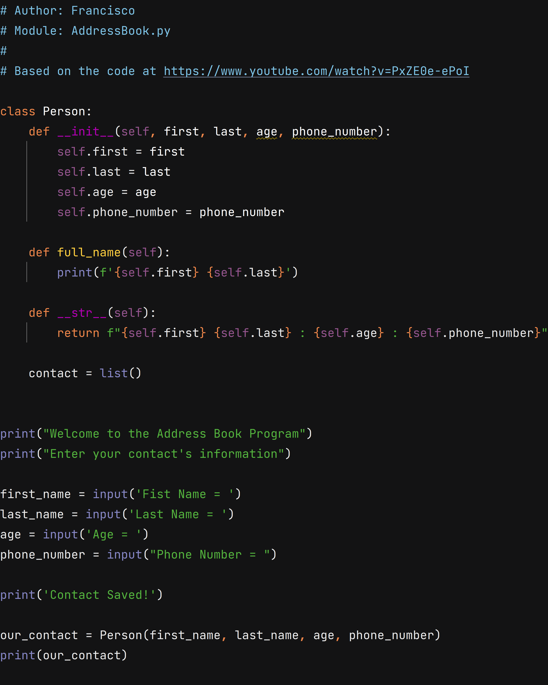

# Free Code Camp - Tribute Page

This is my solution of the Create an Address Book as proposed on this video
[Building an Address Book in Python](https://www.youtube.com/watch?v=PxZE0e-ePoI).

## Table of contents

- [Overview](#overview)
  - [The challenge](#the-challenge)
  - [Screenshot](#screenshot)
- [My process](#my-process)
  - [Built with](#built-with)
  - [What I learned](#what-i-learned)
- [Author](#author)

## Overview

### The challenge

Create an Address book like the one in the video. 

### Screenshot



## My process

### Built with

- Python 3

### What I learned

I did this project in my spare time to learn some object creation and manipulation in Python. It was a simple, but cool project because I learned how to create objects in Python, as you can see below. 

```python
    def __init__(self, first, last, age, phone_number):
        self.first = first
        self.last = last
        self.age = age
        self.phone_number = phone_number
```


## Author

- Linkedin - [@franciscojcardoso/](https://www.linkedin.com/in/franciscojcardoso)
